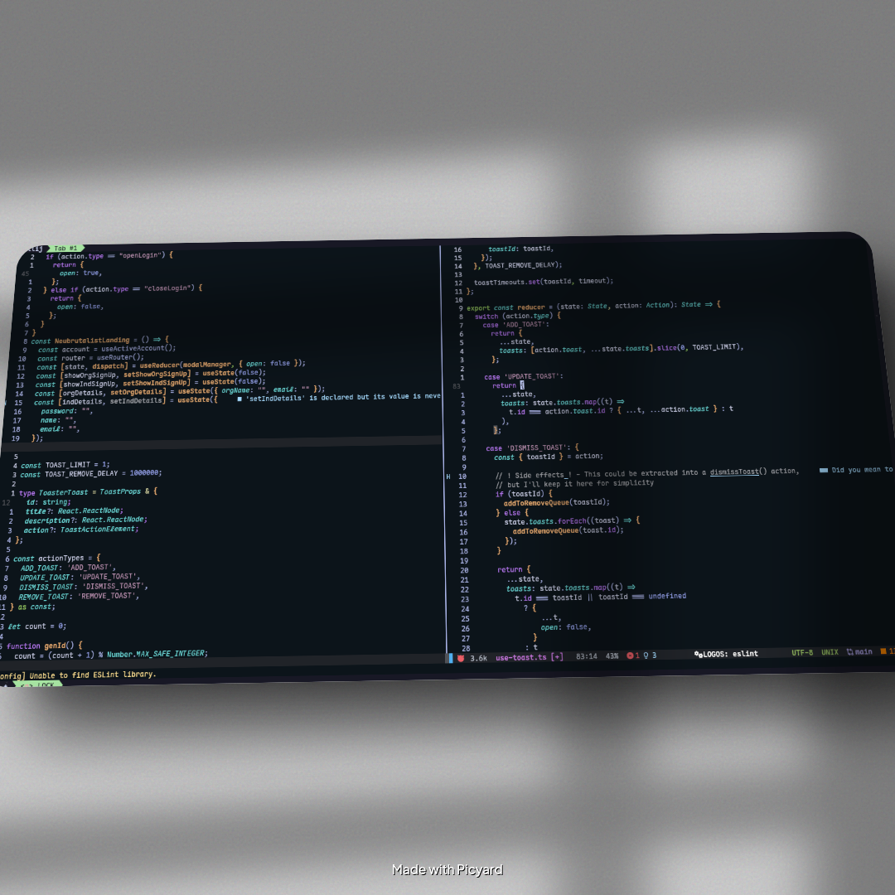
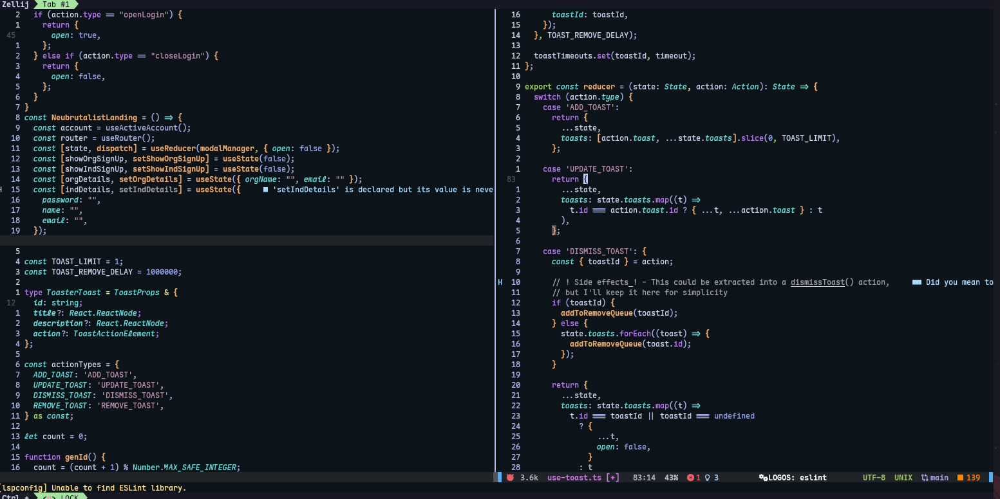

# umunthu.nvim
Umunthu is a a coloscheme inspired by everblush and nord. The goal is to keep it minimal. 
> [!NOTE]
> umunthu means "humanity" or "humility". It is chinyanja/chichewa

 
 


<p align="center">
	<a href="https://github.com/mtendekuyokwa19/umunthu.nvim/stargazers">
		
	</a>
	<a href="https://github.com/mtendekuyokwa19/umunthu.nvim/issues">
		
	</a>
	<a href="https://github.com/mtendekuyokwa19/umunthu.nvim/contributors">
		
	</a>
</p>
##Features

- Purposeful color separation between variables, functions, statements, and constants

- Optimized for modern Lua-based Neovim setups

- Custom highlights for Telescope, line numbers, and statusline

## Installation
```lua

{
  "mtendekuyokwa19/umunthu.nvim",
}
```
## Color pallette

| Group           | Color                        |
| --------------- | ---------------------------- |
| Background      | `#0C141A`                    |
| Foreground      | `#A8B2E6`                    |
| Error           | `#CC5252`                    |
| Function        | `#E6AC73`                    |
| Preprocessor    | `#A3D96C`                    |
| Identifier      | `#6DD9D9`                    |
| Statement       | `#B67AF2`                    |
| Constant        | `#919FE6`                    |
| String          | `#b48ead`                    |
| Variable        | `#C8CDE6`                    |
| Operator        | `#E6E6B1`                    |
| Delimiter       | `#9CC5FF`                    |
| Line Number     | `#343434`                    |
| LineNrAbove     | `#C8CDE6`                    |
| LineNrBelow     | `#AAB4E6`                    |
| CursorLineNr    | `#B8BFE6`                    |
| Statusline      | `#676767`                    |
| Telescope Title | FG: `#e0def4`, BG: `#232136` |

## Roadmap
1. Add vim documentation 
2. work on better highlights for typescript, lua,html,python and lua
3. add support for zellij
4. support all mainstream plugins

## License
MIT

with regards
    [Mtende Kuyokwa](https://mtende.blog) 
